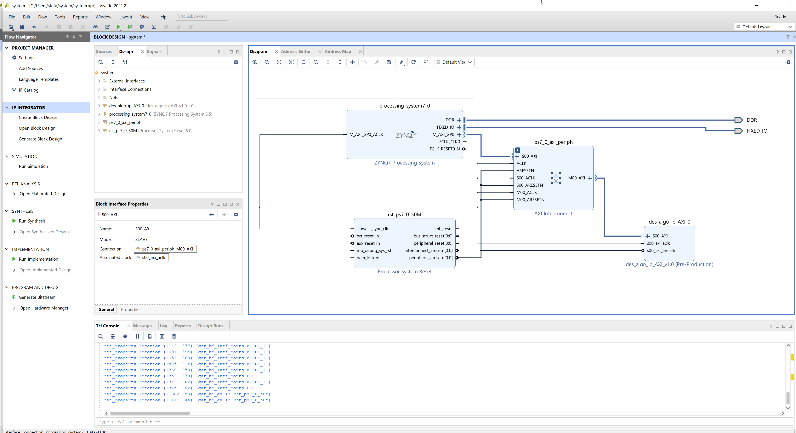
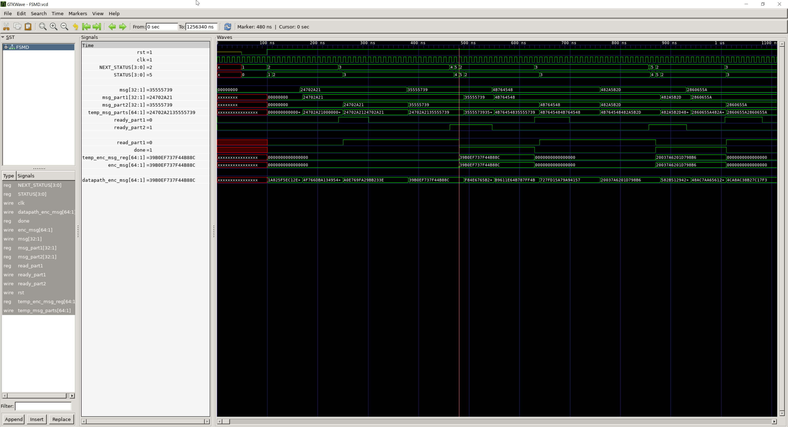

# DES-FPGA

Implementazione in Verilog dell'algoritmo DES per la programmazione della scheda Xilinx PYNQ-Z1.

|Block Diagram|FSMD Waves|
|-------------|----------|
|||

## Dettagli implementativi
Per la documentazione completa consultare il file [```Relazione.pdf```](Relazione.pdf).

## Contenuto repository

Questo repository contiene le seguenti cartelle:
* ```dist```: contiene script ```des.py``` per programmare e controllare la FPGA, piu' i relativi file di test
    > Lo script ```des.py``` deve essere copiato sulla FPGA insieme al file Bitstream e il Block Design generati dal software Xilinx Vivado.

* ```docs```: contiene i sorgenti LaTeX della documentazione con gli asset (immagini, svg, ...).
    > La documentazione compilata e' presente nella root del repository con il nome ```Relazione.pdf```

    > La compilazione della documentazione e' stata fatta attraverso la estensione LaTeX Workshop per Visual Studio Code per gestire le modifiche in tempo reale.

* ```src```: contiene i sorgenti Verilog che implementano l'algoritmo DES.

    Il Top Model e' contenuto nel file ```FSMD.v```: all'interno del modulo e' definita la macchina a stati (che gestisce input e output dell'algoritmo) e vengono istanziati moduli che sono utilizzati dalla FSM per eseguire la parte crittografica dell'algoritmo.

* ```tests```: contiene test e i Makefile per il framework [cocotb](https://docs.cocotb.org/en/stable/), e test bench semplici in Verilog.

    Per eseguire i test utilizzare il Makefile chiamato ```Makefile``` (senza altri caratteri nel nome).
    > Per lanciare i test e' necessario aver installato [Python](https://www.python.org/), [cocotb](https://docs.cocotb.org/en/stable/install.html) tramite pip e [Icarus Verilog](http://iverilog.icarus.com/) (simulatore Verilog)

    I test esporteranno nella stessa cartella file VCD (Value Change Dump) con le forme d'onda visualizzabili con un tool compatibile con il formato.
    > Come [GTKWave](http://gtkwave.sourceforge.net/)

* ```utility```: contiene script utilizzati per sviluppare moduli Verilog che richiedevano passaggi ripetitivi (S Box e le permutazioni) oppure che restituiscono gli output della computazione effettuata sulla chiave di cifratura (cartella ```keys```).
    > Per modificare la chiave attuale e' possibile generare questi moduli attraverso lo script ```utility/keys/gen_kn.py```

Il repository contiene anche i seguenti file:
* ```.editorconfig```: imposta automaticamente i caratteri di terminazione della riga in formato Unix, di lasciare una riga vuota a fine file, ...

* ```.gitignore```: ignora output dei test, delle utility e gli output intermedi della documentazione

* ```README.md```: questo documento

* ```Relazione.pdf```: output della documentazione LaTeX della cartella ```docs```

## Changelog

**2022-03-30**:

Seconda versione. Cambio di specifica: i round sono implementati all'interno della macchina a stati.

Modifiche:
* Rimosso il file verilog ```DES.v``` contenente l'implementazione asincrona dei round e i relativi test.
* Rimossi i file f_kn.v (dove n va da 1 a 16) e lo script Python di generazione di quei moduli. Sono stati rimpiazzati dal multiplexer K_selector.
* Permutazione iniziale e permutazione finale vengono gestiti, sempre dai moduli IP.v e inverse_IP.v, attraverso stati della FSM.
* Aggiunti nuovi stati alla FSM per gestire permutazione iniziale, la selezione dei valori Kn, i 16 round e la permutazione finale.
* Modificata la documentazione per contenere schemi e informazioni aggiornate.

**2022-03-25** ([commit 52ae7b7](https://github.com/mario33881/des-fpga/tree/52ae7b71e112ac738339840e71f9935eefda7908)):

Prima versione. L'implementazione dei round era asincrona.

## Autore
[Zenaro Stefano (mario33881)](https://github.com/mario33881)
